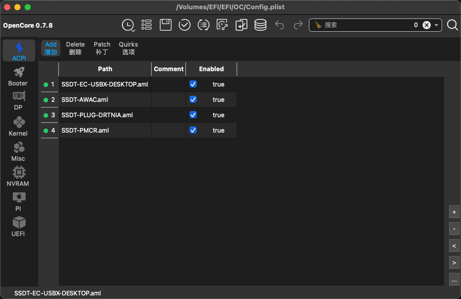
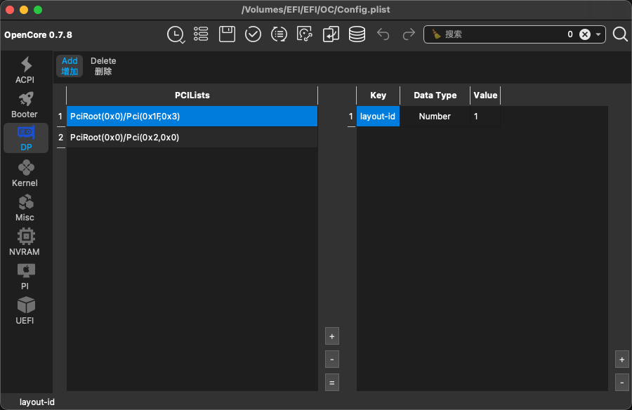
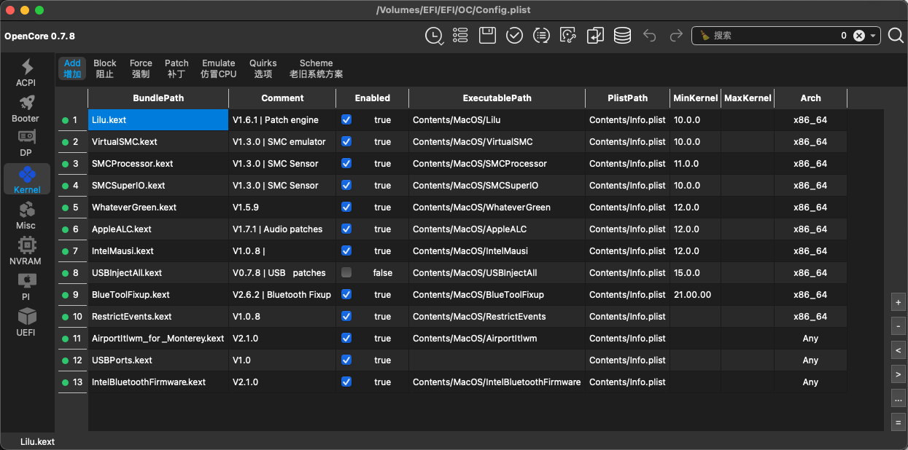
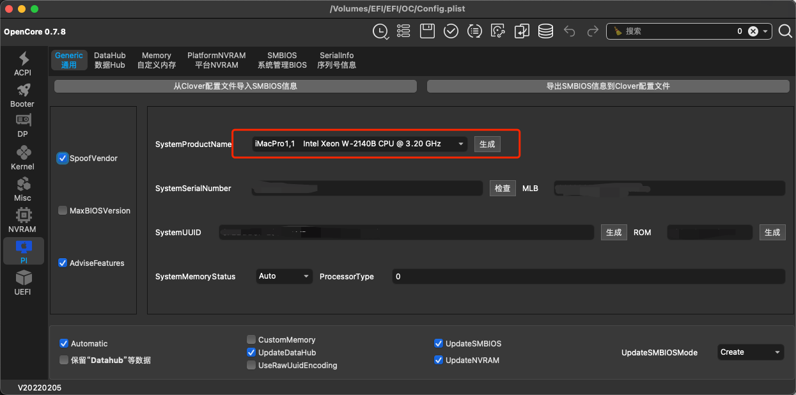

# Hackintosh-Asus-Z390i_i9-9900KF_RX5700XT_Monterey12.3.1

## Introduction
**Monterey 12.3.1 Hackintosh EFI**
>Thanks To https://blog.daliansky.net/ for EFI boot file. If you want the newest Clover、Opencore and PE boot EFI file please use wechat to add '黑果小兵的部落阁'.

## Hardware Information
**Mother Board:** Asus ROG STRIX `Z390-i` Gaming (Coffee Lake)

**CPU:** Intel i9 9900KF (Without Embedded GPU)

**GPU:** AMD Radeon RX 5700XT (8176M)

**Machine Box:** Razer ITX

## Install Tips:
1. **BIOS Setting**
    1. Turn Off
        1. Fast Boot
        2. VT-d
        3. CSM
        4. Thunderbolt
        5. Intel SGX
        6. Intel Platform Trust
        7. CFG Lock
        8. secure Boot
        9. Parallel Port
        10. Serial/COM Port
    2. Turn On
        1. VT-x
        2. UEFI Boot Mode
        3. AHCI hard disk mode
        4. Above 4G decoding
        5. Hyper-Threading
        6. Execute Disable Bit
        7. EHCI/XHCI Hand-off
        8. OS type: Windows UEFI Mode
        9. Legacy RTC Device
2. **Use HDMI (not DP) When Installing**
3. **Use USB2.0 Port To Install The System**
4. **5700XT Black Screen**
    1. Add OpenCore Execute Parameter `-agdpmod=pikera`
5. **BlueTooth Not Working Or Stucked (Very Slow When Booting Computer):**
    1. Download the driver through `https://github.com/OpenIntelWireless/IntelBluetoothFirmware/archive/refs/tags/v2.1.0.zip`
    2. Add `IntelBluetoothFirmware.kext` and `BlueToolFixup.kext` (without `IntelBluetoothInjector.kext`)
    3. Change `config.plist`
6. **Use 2017 iMac Hardware Info**

>The config.plist and kext in project has fixed up the `BlueTooth problem`, you don't need to change that again :). Tips 5 is just for problem recording.

## Buy Me A Coffee ☕️

## 中文介绍
**Monterey 12.3.1 Hackintosh EFI**
>感谢黑果小兵 https://blog.daliansky.net/ 提供的Monterey 12.3.1 dmg U盘三区文件,同时支持Clover/OpenCore/PE，当然需要先关注'黑果小兵的部落阁'微信公众号然后打赏之后才有下载消息，毕竟谁都不容易，根据自己的经济情况尽量多的给到作者支持吧 : )

## 硬件信息
**MotherBoard:**  Asus ROG STRIX `Z390-i` Gaming (Coffee Lake) (华硕z390i)

**CPU:** Intel i9 9900KF (无核显版本)

**GPU:** AMD Radeon RX 5700XT (8176M)

**Machine Box:** Razer ITX (雷蛇ITX机箱，箱子其实也不小。。。)

## 安装说明
### BIOS配置
#### 禁用清单
    Fast Boot - 快速启动
    VT-d (can be enabled if you set DisableIoMapper to YES) - VT-d（如果DisableIOMapper Quicks设置为YES，则可以启用）
    CSM - CSM 兼容性支持模块
    Thunderbolt - 雷雳
    Intel SGX - 英特尔SGX
    Intel Platform Trust- 英特尔平台信任
    CFG Lock (MSR 0xE2 write protection) - CFG锁（MSR 0xE2写保护）（必须关闭，如果找不到该选项，则在OpenCore的config-内核-> Quirks下启用与CFG Lock相关选项）
    ecure Boot - 安全启动
    Parallel Port - 并口
    Serial/COM Port - 串行/COM端口

#### 启用清单
    VT-x - VT-x
    UEFI Boot Mode UEFI启动模式。请不要使用Legacy
    硬盘模式：改为AHCI。不能用IDE和RST RAID。
    Above 4G decoding - 大于4G地址空间解码
    Hyper-Threading - 超线程
    Execute Disable Bit - 执行禁用位
    EHCI/XHCI Hand-off - EHCI / XHCI接手控制
    OS type: Windows 8.1/10 UEFI Mode - 操作系统类型：Windows 8.1 / 10 UEFI模式
    DVMT Pre-Allocated(iGPU Memory): DVMT预分配（iGPU内存）：64MB（如果能设Max就设）
    Legacy RTC Device - 传统RTC设备
    
1. **用HDMI接口启动安装，别用DP**
2. **U盘安装时要用2.0的端口去安装**
3. **5700XT 安装黑屏问题**
    1. 添加OpenCore执行参数 `-agdpmod=pikera`
4. **蓝牙无法使用以及电脑启动超级慢问题 (项目里面这个已经配置过了，只是做个记录，下载直接用就好了，不需要修改了):**
    1. 先下载 `https://github.com/OpenIntelWireless/IntelBluetoothFirmware/archive/refs/tags/v2.1.0.zip`
    2. 然后添加 `IntelBluetoothFirmware.kext` 和 `BlueToolFixup.kext` (不需要 `IntelBluetoothInjector.kext`)
    3. 修改config.plist配置
5. **用17年iMac的硬件信息**

# Screenshot

## 请我喝杯咖啡吧 ☕️

